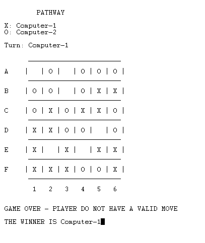

# FPL - Trabalho Prático 2

## Descrição do jogo - PATHWAY

### Introdução

Pathway é um jogo de tabuleiro 6x6 que envolve apenas 2 jogadores, o Vermelho e o Azul, em que na sua vez têm que colocar uma peça da sua cor no tablueiro.

### Objetivo do jogo

O primeiro jogador que não consegue fazer nenhuma jogada é o **vencedor**.

### Regras

Inicialmente todos os quadrados do tabuleiro estão **todos desocupados**.  

**Movimentos possíveis**:

**1** - Pode-se colocar peças sem formar nenhuma connexão  
**2** - Pode-se colocar peças em quadrados que formam exatamente uma conexão amigável, independentemente das conexões inimigas que se criem

Sendo que:
 - **ADJACÊNCIAS** são ortogonais (horizontal ou vertical).
 - **CONEXÃO AMIGÁVEL** é uma adjacência entre dois quadrados com peças da mesma cor
 - **CONEXÂO INIMIGA** é uma adjacência entre dois quadrados com peças de cor diferentes

 Jogo Oficial: [PATHWAY](http://www.marksteeregames.com/Pathway_rules.pdf)


## Lógica do jogo

### Representação interna do estado do jogo

O estado do jogo é representado através do **Board**, **Turn** e **Players**.  O Board, que representa o tabuleiro de jogo, foi definido com listas de listas de inteiros. O Turn representa o turno atual, ou seja, indica qual jogador detém a vez de jogar e foi definido por um inteiro. Por fim o Player caracteriza o jogador (humano ou cpu) representado por uma string.
  
``` 
Estado do jogo pode definir-se como:
GameState = Board/Turn/Players
``` 
Alguns exemplos :
```
Jogo Inicial:  
Board = [ [0,0,0,0,0,0], 
          [0,0,0,0,0,0],
          [0,0,0,0,0,0], 
          [0,0,0,0,0,0],
          [0,0,0,0,0,0],
          [0,0,0,0,0,0] ]. 
Turn = 1  
Players = "prolog"/"haskell"

Jogo Intermédio:  
Board = [ [2,1,2,1,2,2],
          [2,1,1,1,1,1],
          [1,2,1,0,1,2],
          [2,2,2,1,1,2], 
          [2,1,1,2,2,0], 
          [1,1,0,0,0,0] ].
Turn = 2
Players = "prolog"/"Computer"

Jogo Final:  
Board = [ [2,1,2,1,2,2], 
          [2,1,1,1,1,1],
          [1,2,1,0,1,2], 
          [2,2,2,1,1,2],
          [2,1,1,2,2,0], 
          [1,1,0,2,0,2] ].
Turn = 1
Players = "Computer-1"/"Computer-2"
``` 

### Visualização do estado de jogo

A visualização do estado de jogo está dividida em 2 predicados principais **display_menu/0** e **display_game(+GameState)**. Para o menu foi criada uma interface com o utilizador na qual são mostradas as opções de jogo e espera-se pelo input do utilizador. De acordo com o input do utilizador a opção será validada através de factos criados, e caso seja uma opção inválida, o programa irá informar o utilizador com uma mensagem de erro e voltar a pedir uma opção correta. Depois de escolhida a opção, e caso pelo menos um dos jogadores seja um humano, existe também a opção de o(s) jogador(es) escolher(em) o nome e depois é mostrado o tabuleiro de jogo. Para o estado do jogo é apresentado qual dos símbolos do jogo ('X' ou 'O') cada jogador está associado, um tabuleiro em que as linhas estão representadas por letras (A, B, C, D, E, F) e as colunas por números (1, 2, 3, 4, 5, 6). Cada jogador insere a sua escolha para a linha e coluna e, caso a jogada efetuada seja válida, é apresentado o símbolo associado ao jogador no tabuleiro na posição escolhida. Se os caracteres inseridos não corresponderem a uma jogada válida irá ser apresentado uma mensagem de erro ao utilizador.
 
Visualização do Menu  


Escolha de Nomes  


Visualização do Jogo  


### Execução de Jogadas

Para a execução da jogada é utilizado o predicado **move(+GameState, +Move, -NewGameState)**. Através deste predicado vai ser usado o estado atual do tabuleiro, atualizado com a informação da jogada (Move) incluindo a coluna e linha da jogada efetuada, de acordo com o turno atual. Por fim retorna um novo estado de jogo, estado esse que vai ser o novo estado a ser utilizado.

### Final do Jogo

É feita a verificação de jogadas válidas com o predicado **game_over(+GameState, -Winner)** onde é obtido uma lista com as jogadas possíveis através do predicado **valid_moves/2**. Caso a lista obtida for vazia, não é possível fazer mais nenhuma jogada pelo que Winner irá corresponder ao jogador com o turno atual e o jogo terminará, caso contrário, Winner irá ser igual a 0 e o jogo continuará.

Final do Jogo  


### Lista de Jogadas Válidas

A lista de jogadas válidas é obtida através do predicado **valid_moves(+GameState, -ListOfMoves)** onde é usado o **findall/3** sendo a aplicação feita da seguinte forma **findall(Move, try_move(Board,Turn,Move), ListOfMoves)**. Desta forma são testadas todas as jogadas possíveis, mas apenas serão obtidas as jogadas válidas, que ,tal como foi previamente referido, serão necessárias para poder avaliar a situação de fim de jogo e comparação do movimento introduzido a fim de validar, ou não, a jogada. 

### Jogada do Computador

Para a escolha de uma jogada por parte do computador, o predicado **choose_move(+GameState, +Level, -Move)** é utilizado, onde **Level** será sempre igual a 1, uma vez que só temos o nível 1 de dificuldade (jogada válida aleatória) implementado.

É chamada a **valid_moves(+GameState, -ListOfMoves)** que é usada para obter uma lista de todos os movimentos possíveis, para ser possível a escolha de uma jogada com a utilização de **random_move(-Move, +ListOfMoves)**, onde é selecionada de forma aleatória uma jogada presente na lista.

## Conclusões

No começo foram encontradas algumas dificuldades na adaptação à linguagem prolog pois é uma linguagem muito diferente do habitual. A parte mais essencial do jogo estava maioritariamente ligada à matéria lecionada nas últimas semanas (loops), o que nos dificultou na tentativa de realizar a implementação do projeto com mais alguma antecedência limitando assim o tempo na última parte. 

Algumas melhorias que poderiam ser feitas ao jogo seria a existência de um 'bot' com dificuldade de jogo avançada e o tabuleiro ser de tamanho flexível. Apesar das dificuldades, foi um projeto divertido de realizar, com uma linguagem fora da caixa, que nos permitiu realizar um jogo do qual estamos orgulhosos.

## Bibliografia
- Slides e Apontamentos das aulas teóricas de PFL
- [Documentação SICStus](https://sicstus.sics.se/documentation.html)
- http://www.marksteeregames.com/Pathway_rules.pdf