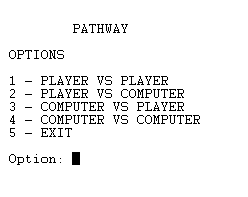
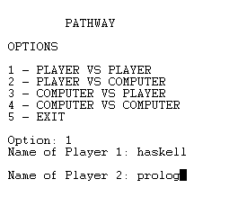
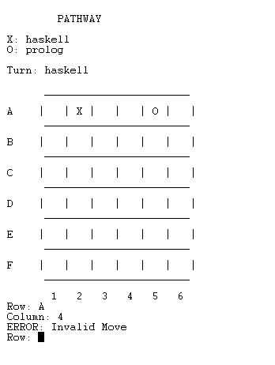

# FPL - Trabalho Prático 2

## Descrição do jogo - PATHWAY

### Introdução

Pathway é um jogo de tabuleiro 6x6 que envolve apenas 2 jogadores, o Vermelho e o Azul, em que na sua vez têm que colocar uma peça da sua cor no tablueiro.

### Objetivo do jogo

O primeiro jogador que não consegue fazer nenhuma jogada é o **vencedor**.

### Regras

Inicialmente todos os quadrados do tabuleiro estão **todos desocupados**.  

**Movimentos possíveis**:

**1** - Pode-se colocar peças sem formar nenhuma connexão  
**2** - Pode-se colocar peças em quadrados que formam exatamente uma conexão amigável, independentemente das conexões inimigas que se criem

Sendo que:
 - **ADJACÊNCIAS** são ortogonais (horizontal ou vertical).
 - **CONEXÃO AMIGÁVEL** é uma adjacência entre dois quadrados com peças da mesma cor
 - **CONEXÂO INIMIGA** é uma adjacência entre dois quadrados com peças de cor diferentes

 Jogo Oficial: [PATHWAY](http://www.marksteeregames.com/Pathway_rules.pdf)


## Lógica do jogo

### Representação interna do estado do jogo

O estado do jogo é representado através do Board, Turn e Players.  O Board, que representa o tabuleiro de jogo, foi definido com listas de listas de inteiros. O Turn representa o turno atual, ou seja, indica qual jogador detém a vez de jogar e foi definido por um inteiro. Por fim o Player caracteriza o jogador (humano ou cpu) representado por uma string.
  
``` 
Estado do jogo:
GameState = Board/Turn/Players
``` 

```
Jogo Inicial:  
Board = [ [0,0,0,0,0,0], 
          [0,0,0,0,0,0],
          [0,0,0,0,0,0], 
          [0,0,0,0,0,0],
          [0,0,0,0,0,0],
          [0,0,0,0,0,0] ]. 

Jogo Intermédio:  
Board = [ [2,1,2,1,2,2],
          [2,1,1,1,1,1],
          [1,2,1,0,1,2],
          [2,2,2,1,1,2], 
          [2,1,1,2,2,0], 
          [1,1,0,0,0,0] ].

Jogo Final:  
Board = [ [2,1,2,1,2,2], 
          [2,1,1,1,1,1],
          [1,2,1,0,1,2], 
          [2,2,2,1,1,2],
          [2,1,1,2,2,0], 
          [1,1,0,2,0,2] ].
``` 

``` 
Turn:  
Turn is 1  
Turn is 2
```

```
Player:  
Players = P/"Computer"
```  

    

### Visualização do estado de jogo

A visualização do estado de jogo está dividida em 2 predicados principais display_menu e display_game. Para o menu foi criada uma interface com o utilizador na qual são mostradas as opções de jogo e espera-se pelo input do utilizador. De acordo com o input do utilizador a opção será escolhida ou, caso seja uma opção inválida, o programa irá informar o utilizador da invalidade do mesmo. Depois de escolhida a opção, e caso um dos jogadores seja um humano, existe também a opção de o jogador escolher o nome e depois é então mostrado o tabuleiro de jogo. Para o estado do jogo é apresentado qual dos símbolos do jogo ('X' ou 'O') está associado, um tabuleiro em que as linhas estão representadas por letras (A, B, C, D, E, F) e as colunas por números (1, 2, 3, 4, 5, 6). Cada jogador insere a sua escolha para a linha e coluna e, caso a jogada efetuada seja válida, é apresentado o símbolo associado, anteriormente referido. Se os caracteres inseridos não corresponderem a uma jogada válida essa informação será apresentada ao utilizador.
 
Visualização do Menu  


Escolha de Nomes  


Visualização do Jogo  



### Execução de Jogadas

### Final do Jogo

### Lista de Jogadas Válidas

### Jogada do Computador

Para a escolha de uma jogada por parte do computador, o predicado **choose_move(+GameState, +Level, -Move)** é utilizado, onde **Level** será apenas uma variável aleatória, uma vez que só temos essa versão no jogo.

Para começar a **valid_moves(+GameState, -ListOfMoves)** é usada para obter uma lista de todos os movimentos possíveis, para a ser possível a escolha de uma jogada com a utilização de **random_move(-Move, +ListOfMoves)**, onde é selecionada de forma aleatória uma jogada dentro das apresentadas na lista.


## Conclusões

No começo foram encontradas algumas dificuldades na adaptação à linguagem prolog e na sua implementação ao jogo pretendido. A parte mais essencial do jogo estava maioritariamente ligada à matéria lecionada apenas nas últimas aulas, o que nos dificultou na tentativa de realizar as valorizações referidas no enunciado do projeto. Dessa forma, algumas melhorias que poderiam ser feitas, seriam as valorizações, como por exemplo, a existência de um bot com dificuldade de jogo avançada e o tabuleiro ser de tamanho flexível. Apesar das dificuldades, foi um projeto muito divertido de realizar, com uma linguagem fora da caixa, que nos permitiu realizar um jogo do qual estamos muito orgulhosos.

## Bibliografia
- Slides e Apontamentos das aulas teóricas de PFL
- [Documentação SICStus](https://sicstus.sics.se/documentation.html)